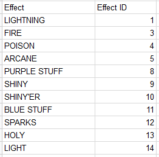

# Visuals: Elemental Effects
### To put vidual elemental effects on a hero:
1. Go to the raw tab for the Hero
2. Drop down the `digest` tab
3. drop down `visual_equipment` tab and click on `visual_item` 
4. when you highlight `visual_item` 3 dots will appear on the right hand side of your screen and click on those dots.  
  _only items that have elements on them are 0,4,5, and 6_
5. click on 1 of those 4 and enter 1-14 in the "effect type"  
  _you can change how powerful the effect is by raising the "effect level" higher (10 is max)_
  

